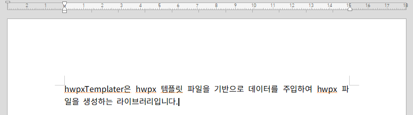

### **1.1 요구사양**
---
HwpxTemplater를 사용하시려면 반드시 Java8, 혹은 높은 버전의 자바를 사용하셔야 됩니다.

### **1.2 설치하기**
---
빌드 도구로 maven을 사용하시는 경우에는 아래의 dependency를 pom.xml 파일에 추가해주세요. 

<br> 

```xml
<dependency>
  <groupId>com.mumberrymountain</groupId>
  <artifactId>hwpxtemplater</artifactId>
</dependency>
```

<br> 

gradle을 사용하시는 경우에는 아래의 implementation을 build.gradle 파일에 추가해주세요.

<br> 

```gradle
implementation 'com.mumberrymountain:hwpxtemplater'
```

<br>

빌드가 잘 이뤄져 `hwpxtemplater`가 정상적으로 설치되었다면 실제로 `hwpxTemplater`가 제대로 동작하는지 확인이 필요합니다. <br>

아래 아미지처럼 `hwpxptemplater.hwpx`라는 이름의 파일을 하나 만든 뒤 `{hwpxTemplater}`라는 필드를 넣어줍니다. <br> <br>

|  |
|:-----------------------------------------------------------------:|
|                       *hwpxtemplater.hwpx*                        |

파일을 만들었다면 프로젝트의 적절한 경로에 파일을 넣어둔 뒤, 아래 자바 코드를 경로만 적절하게 바꿔 붙여넣기해주세요. <br>

그리고 해당 코드를 실행하여 hwpx 파일을 생성해줍니다. 

<br>

```java
import javax.servlet.http.HttpServletResponse;
import kr.mumberrymountain.hwpxtemplater.HWPXTemplater;

response.setHeader("Content-Disposition", "attachment;filename=" + "hwpxtemplater_output.hwpx" + ";");

HWPXTemplater hwpxTemplater = HWPXTemplater.builder()
                .parse("./hwpxtemplater.hwpx") // 프로젝트에서 파일이 위치한 경로를 잡아주세요.
                .render(new HashMap<String, Object>() {{
                    put("hwpxTemplater", "hwpxTemplater은 hwpx 템플릿 파일을 기반으로 데이터를 주입하여 hwpx 파일을 생성하는 라이브러리입니다.");
                }})
                .write(response.getOutputStream());
```

<br>

설치가 정상적으로 이뤄졌다면, 아래와 같이 `hwpxTemplater` 필드에 데이터가 기입되어 `hwpxtemplater_output.hwpx`라는 파일이 새롭게 생성된 걸 확인하실 수 있을 겁니다.

<br>

|  |
|:------------------------------------------------------------------|
| *hwpxtemplater_output.hwpx*                                              |
