### **2.1 템플릿의 종류**
---

hwpxTemplater은 기본적으로 `{{`로 시작하고 `}}`로 끝나는 태그 내부에 특정한 데이터를 렌더링하여 다운로드하는 방식으로 동작합니다.

사용자가 태그 내부에 `key` 값을 기입하면 해당 `key`에 대응되는 `value` 값을 기입하는 방식입니다.

라이브러리에서 제공하는 태그의 종류로는 기본적으로 다음 다섯 가지가 있습니다. <br>

| 예시                   | 태그         | 설명                                                   |
|----------------------|--------------|------------------------------------------------------|
| `{{replace}}`        | 기본 태그     | 기본적인 텍스트를 hwpx 파일에 렌더링하기 위한 태그입니다.                   |
| `{{?if}}{{/if}}`     | 조건문 태그   | 조건문이 참인지 거짓인지 여부에 따라 태그 내 데이터를 렌더링할지 여부를 결정하는 태그입니다. |
| `{{#loop}}{{/loop}}` | 반복문 태그   | 태그 내 데이터를 반복문으로 렌더링하기 위한 태그입니다.                      |
| `{{$image}}`         | 이미지 태그   | 이미지를 hwpx 파일에 렌더링하기 위한 태그입니다.                        |
| `{{@table}}`         | 테이블 태그   | 테이블을 hwpx 파일에 렌더링하기 위한 태그입니다.                        |

### **2.2 기본 태그**
---

기본 태그는 hwpxTemplater의 가장 기본적인 태그로, hwpx 템플릿 파일에 특정 데이터를 렌더링하기 위해 사용됩니다. 

| 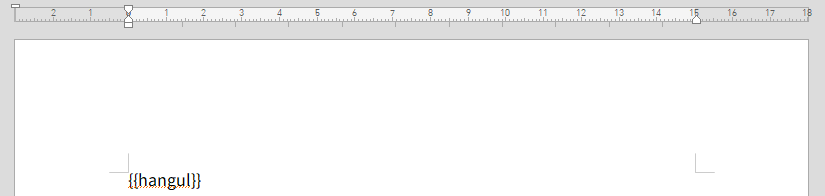 |
|:------------------------------------------------------------------|

예를 들어 위처럼 hwpx 템플릿 파일에 `{{hangul}}`이라는 필드가 있다고 가정합시다. <br>

```java
import javax.servlet.http.HttpServletResponse;
import kr.mumberrymountain.hwpxtemplater.HWPXTemplater;
import java.util.*;

HWPXTemplater hwpxTemplater = HWPXTemplater.builder()
                    .parse("./hwpxtemplater.hwpx")
                    .render(new HashMap<String, Object>() {{
                        put("hangul", "한글");
                    }})
                    .write(response.getOutputStream());
```

<br>

해당 key에 해당하는 데이터로 `한글`을 설정할 경우

<br>

| 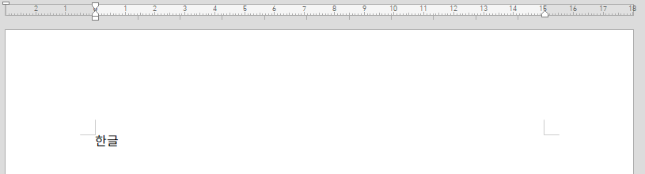 |
|:------------------------------------------------------------------|

`{{hangul}}` 필드는 다운받는 파일에서 이미지처럼 `한글`로 대체될 겁니다.

### 2.3 조건문 태그 
---

조건문 태그는 조건에 따라 태그 내부의 데이터를 렌더링할지 여부를 판단하는 태그입니다.

`{{?condition}}{{/condition}}`과 같은 방식으로 사용되며, 이때 해당 key에 해당하는 데이터가 참인지 거짓인지 여부에 따라 내부 데이터의 렌더링 여부를 판단합니다.

| 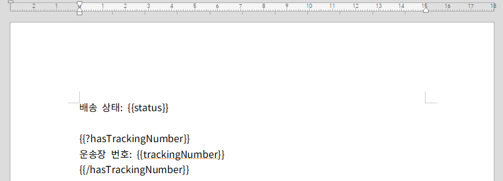 |
|:------------------------------------------------------------------|

예를 들어 위처럼 템플릿 파일에 `hasTrackingNumber`라는 조건문 태그가 있고, 태그 내부에 `운송장 번호: {{trackingNumber}}`라는 데이터 및 기본 태그가 포함되어 있다고 가정합시다. <br>

```java
import javax.servlet.http.HttpServletResponse;
import kr.mumberrymountain.hwpxtemplater.HWPXTemplater;
import java.util.*;

HWPXTemplater hwpxTemplater = HWPXTemplater.builder()
                            .parse("./hwpxtemplater.hwpx")
                            .render(new HashMap<String, Object>() {{
                                put("status", "배송중");
                                put("hasTrackingNumber", true);
                                put("trackingNumber", "1234-5678-9012");
                            }})
                            .write(response.getOutputStream());
```

<br>

이때 조건문 태그 `hasTrackingNumber`의 데이터 값이 true라면 

<br>

| 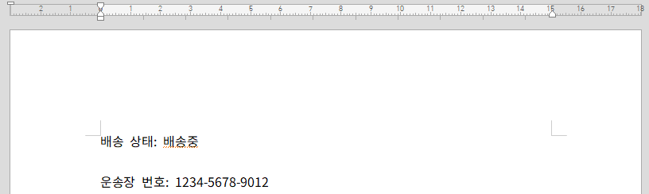 |
|:------------------------------------------------------------------|
| *hasTrackingNumber의 데이터 값이 true인 경우*                                              |

<br>

이미지처럼 `hasTrackingNumber` 태그 내부 데이터가 기본 태그까지 채워져 정상적으로 렌더링이 될 것입니다. 

<br>

```java
import javax.servlet.http.HttpServletResponse;
import kr.mumberrymountain.hwpxtemplater.HWPXTemplater;
import java.util.*;

HWPXTemplater hwpxTemplater = HWPXTemplater.builder()
                            .parse("./hwpxtemplater.hwpx")
                            .render(new HashMap<String, Object>() {{
                                put("status", "배송중");
                                put("hasTrackingNumber", false);
                                put("trackingNumber", "1234-5678-9012");
                            }})
                            .write(response.getOutputStream());
```

<br>

반면 앞서와 달리 조건문 태그 `hasTrackingNumber`의 데이터 값이 false인 경우  

<br>

| 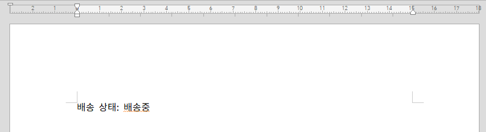 |
|:------------------------------------------------------------------|
| *hasTrackingNumber의 데이터 값이 false인 경우*                                              |

<br>

`hasTrackingNumber` 태그 내부 데이터는 제외하고 템플릿 렌더링이 이뤄지게 됩니다.

### 2.4 반복문 태그 
---

반복문 태그는 반복문을 돌리며 동일하게 반복되는 배열 내 데이터를 렌더링하고 싶을 때 사용하는 태그입니다. 

`{{#loop}}{{/loop}}`와 같은 방식으로 사용되며, 이때 반복문 태그 내부의 기본 태그는 배열 내 데이터로 기입되어 반복적으로 렌더링이 이뤄집니다. 

<br>

| 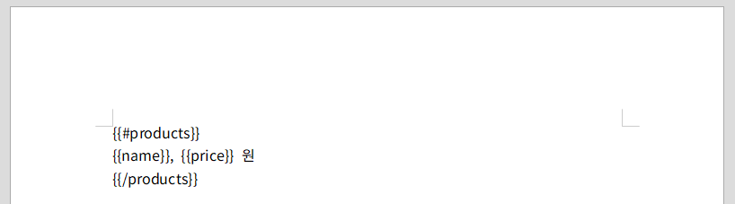 |
|:------------------------------------------------------------------|

예를 들어 이미지처럼 `products` 반복문 태그 내 `name`이라는 태그와 `price`라는 태그가 있다고 가정합시다. 

<br>

```java
import javax.servlet.http.HttpServletResponse;
import kr.mumberrymountain.hwpxtemplater.HWPXTemplater;
import java.util.*;

ArrayList<HashMap<String, Object>> products = new ArrayList<>();

Object[][] datas = {
        {"사과", 1500},
        {"바나나", 700},
        {"오렌지", 1200}
};

for (Object[] data : datas) {
    HashMap<String, Object> product = new HashMap<>();
    product.put("name", data[0]);
    product.put("price", data[1]);
    products.add(product);
}

HWPXTemplater hwpxTemplater = HWPXTemplater.builder()
        .parse("./hwpxtemplater.hwpx")
        .render(new HashMap<String, Object>() {{
            put("products", products);
        }})
        .write(response.getOutputStream());
```

<br>

이때 위 코드에서처럼 `products`라는 반복문 태그에 `name` 데이터와 `price` 데이터가 포함된 `List` 데이터를 넣으면

<br>

| 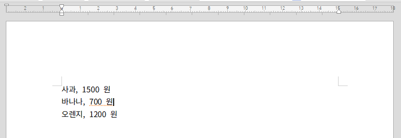 |
|:------------------------------------------------------------------|

<br>

이미지와 같이 반복문이 동작하여 템플릿 렌더링이 이뤄지게 됩니다.

### 2.5 이미지 태그 
---

hwpx 템플릿 파일에 문자열 데이터가 아닌 특정 이미지를 렌더링하고 싶을 때 사용하는 태그입니다. 

`{$image}`와 같은 방식으로 사용되며, 이때 `image` 태그에는 문자열로 삽입한 경로에 해당하는 이미지가 렌더링됩니다. 

<br>

| 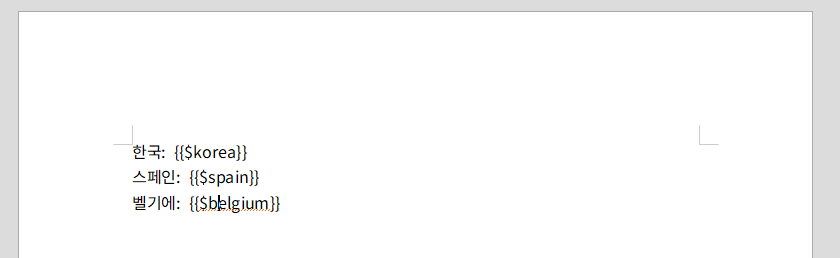 |
|:------------------------------------------------------------------|

<br>

예를 들어 위 이미지와 같이 이미지 태그를 넣고 

<br>

```java
import javax.servlet.http.HttpServletResponse;
import kr.mumberrymountain.hwpxtemplater.HWPXTemplater;
import java.util.*;

HWPXTemplater hwpxTemplater = HWPXTemplater.builder()
                    .parse("./hwpxtemplater.hwpx")
                    .render(new HashMap<String, Object() {{
                        put("korea", "images/country/png/korea.png");
                        put("spain", "images/country/png/spain.png");
                        put("belgium", "images/country/png/belgium.png");
                    }})
                    .write(response.getOutputStream());
```

`korea`, `spain`, `belgium` 이미지 태그에 각개 적합한 이미지 경로를 기입하면

<br>

| 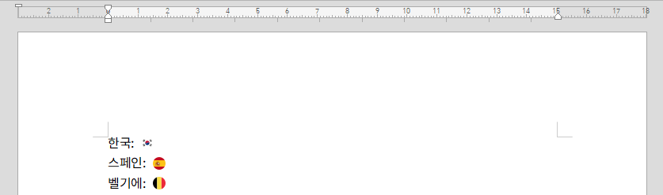 |
|:------------------------------------------------------------------|

<br>

상단의 이미지와 같이 개별 국가에 걸맞는 이미지 렌더링이 위와 같이 적절하게 이뤄집니다.

### 2.6 테이블 태그
---

hwpx 템플릿 파일에 문자열 데이터가 아닌 테이블을 삽입하고 싶을 때 사용하는 태그입니다.

`{@table}`와 같은 방식으로 사용되며, 이때 `table` 태그에는 hwpxTemplater가 제공하는 Table 클래스 모델을 이용해 만든 테이블을 데이터로 넣음으로 hwpx 테이블을 생성할 수 있습니다.

<br>

| 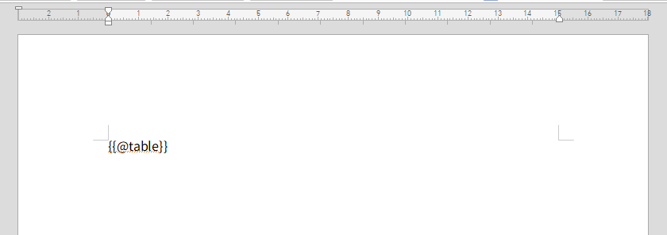 |
|:------------------------------------------------------------------|

<br>

예를 들어 위 이미지와 같이 템플릿에 `table`이라는 테이블 태그를 기입한 경우 

<br>

```java
import javax.servlet.http.HttpServletResponse;
import kr.mumberrymountain.hwpxtemplater.HWPXTemplater;
import kr.mumberrymountain.hwpxtemplater.model.table.Col;
import kr.mumberrymountain.hwpxtemplater.model.table.Table;

Table table = Table.builder()
                    .cols(
                            Arrays.asList(
                                    new Col("번호").width(60),
                                    new Col("이름").width(150),
                                    new Col("점수").width(150),
                                    new Col("비고").width(150)
                            )
                    )
                    .row(new HashMap<String, Object>() {{
                        put("번호", "번호");
                        put("이름", "이름");
                        put("점수", "점수");
                        put("비고", "비고");
                    }})
                    .row(new HashMap<String, Object>() {{
                        put("번호", 1);
                        put("이름", "홍길동");
                        put("점수", 85);
                        put("비고", null);
                    }})
                    .row(new HashMap<String, Object>() {{
                        put("번호", 2);
                        put("이름", "김철수");
                        put("점수", 	90);
                        put("비고", "우수 성적");
                    }})
                    .row(new HashMap<String, Object>() {{
                        put("번호", 3);
                        put("이름", "이영희");
                        put("점수", 78);
                    }})
                    .create();

            HWPXTemplater hwpxTemplater = HWPXTemplater.builder()
                    .parse("./hwpxtemplater.hwpx")
                    .render(new HashMap<String, Object>() {{
                        put("table", table);
                    }})
                    .write(response.getOutputStream());
```

<br>

hwpxTemplater에서 제공하는 Table 클래스를 활용해 만든 테이블 인스턴스를 데이터로 기입함으로

<br>

| 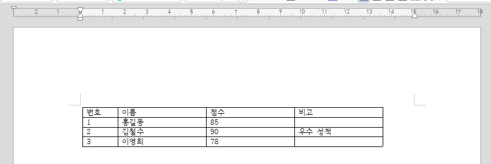 |
|:------------------------------------------------------------------|

<br>

상단 이미지와 같이 테이블을 생성할 수 있습니다.